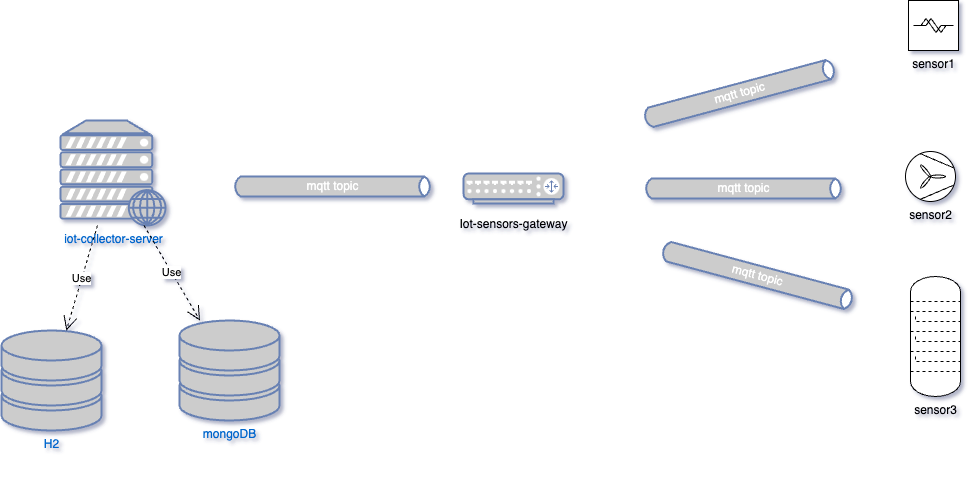

# IoT Collector

## Description
Simple server for collecting Iot data from multiple devices.
The application consists of three services:
* Iot-collector-server rest application to display messages received from the sensors and various statistics
* Iot-sensors-gateway simple application responsible for receiving messages from the sensors validate messages and dispatch to the sever
  The service should be responsible to register a new sensor, collect metrics from sensors and watchdog the devices.
* Iot-sensor Application to simulate a sensor

### Dependencies
* Mqtt-broker message broker standard de facto for device communication.
* MongoDB NOSql db for storing sensors' messages.
* H2 db store user credential

### Architecture





### Pre-Requisite
* Java 17
* maven
* Docker
* docker-compose 

### Run all containers with the solution
If you want simply to test the app and not check the solution

Open a terminal in the project root and run:

`docker-compose --file docker-compose-with-solution.yml up -d`

### Build the app
If you want to check the app and run step by step. 

If you ran `docker-compose --file docker-compose-with-solution.yml up -d`. Please stop some containers

`docker stop iot-sensor-3 iot-sensor-2 iot-sensor-1 iot-sensors-gateway iot-collector-server`

Open a terminal in the project root and run:

`mvn clean package`

it will compile build and run all the tests

### Before Run the application
First time for setting up the containers, enter project's main folder and type:

`docker-compose up -d`

next time to start,

`docker-compose start`

to stop;

`docker-compose stop`

### Start the application
#### iot-collector-server
Open a terminal in the project root and run:

`java -jar iot-collector-server/target/iot-collector-server-1.0-SNAPSHOT.jar`

#### iot-sensors-gateway
Open a terminal in the project root and run:

`java -jar iot-sensors-gateway/target/iot-sensors-gateway-1.0-SNAPSHOT.jar`

#### iot-sensor
If you want to run a single sensor

`java -jar iot-sensor/target/iot-sensor-1.0-SNAPSHOT-fat.jar serial1 temperature.sensor1 -t TEMP -f 10000 &`

`java -jar iot-sensor/target/iot-sensor-1.0-SNAPSHOT-fat.jar -h`

Display a helper

Open a terminal in the project root and run:

`sh run_sensors.sh`

it will start 3 sensors as java process.

To stop them
Open a terminal in the project root and run:

`ps -ef | grep sensor`

you should see something like:
```shell
503 10884     1   0  5:37PM ttys015    0:02.76 java -jar iot-sensor/target/iot-sensor-1.0-SNAPSHOT-fat.jar serial1 temperature.sensor1 -t TEMP -f 10000
503 10885     1   0  5:37PM ttys015    0:02.72 java -jar iot-sensor/target/iot-sensor-1.0-SNAPSHOT-fat.jar serial2 heart_rate.sensor2 -t HEART_RATE -f 20000
503 10886     1   0  5:37PM ttys015    0:02.67 java -jar iot-sensor/target/iot-sensor-1.0-SNAPSHOT-fat.jar serial3 temperature.sensor3  -t FUEL_READER -f 30000
```

Then kill them with 
```shell
kill -Term 10884
kill -Term 10885
kill -Term 10886
```


### How to add a new sensor type
* Add new topic in the project iot-sensor-gateway int `application.properties` file. For example `mqtt-broker.sensor-topics[3]=new_topic`
* Implement a concrete class extending `EngineSensor` in iot-sensor

### Rest Apis
The Project contains a postman collection with all endpoints

The endpoints are:

* GET All messages `http://localhost:9090/api/v1/messages?start=2024-12-07T22:29:42&end=2025-12-08T22:29:42&page=0&size=10&sort=timestamp&direction=DESC`
* GET All messages by serial number `http://localhost:9090/api/v1/messages/serial2?start=2025-12-07T22:29:42&end=2024-12-08T22:29:42&page=0&size=10&sort=timestamp&direction=DESC`
* GET All Statistics `http://localhost:9090/api/v1/messages/statistics`
* GET All Statistics  vy serial number `http://localhost:9090/api/v1/serial2/statistics`

All endpoints need a Bearer token in the `Authorization` header

To fetch the token, please run 
POST `http://localhost:9090/api/v1/login`

With the following JSON body

```json
{
    "username": "massimo",
    "password": "123456"
}
```


The system contains 2 users:

username: massimo password:123456 role:ADMIN

username: koen password:123456 role:USER

ADMIN can call any endpoints

USER can call any endpoints except statistics


### Rest API documentation

Simply run a GET rest call to 

`http://localhost:9090/api/v1/api-docs`

This endpoint is outside security
### Limitation
* Add proper logic Iot-sensors-gateway for validation, orchestration devices
* Add liquibase support for H2
* The server has a simple security. It should have a signed certificate from a REAL authorization server
* Create completely different messages for different type of sensors
* Improve security. Especially in mqtt
* Etc.
